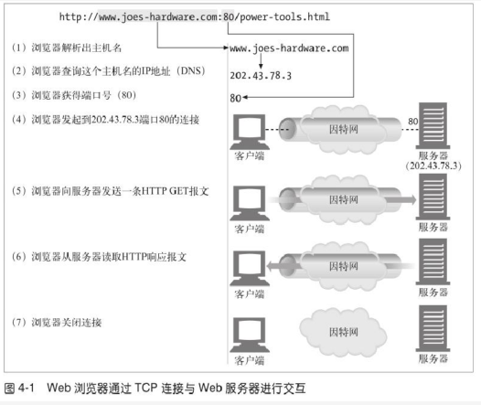
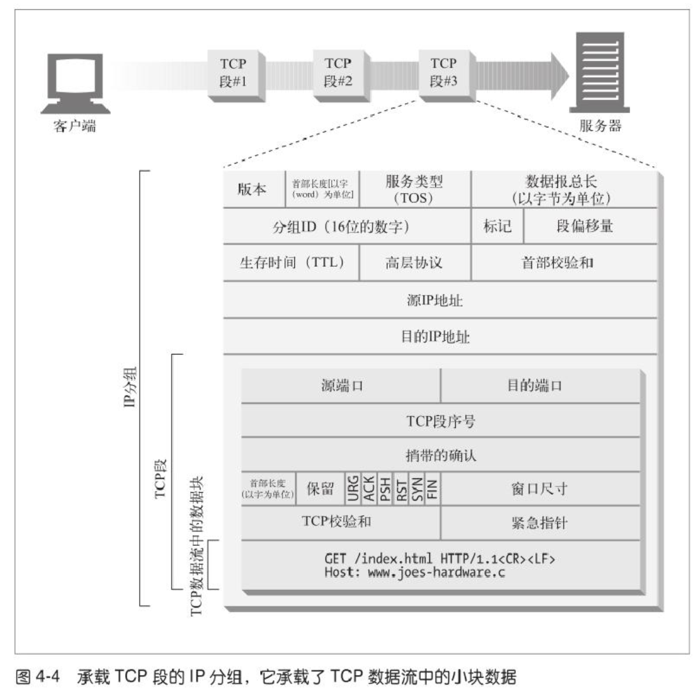
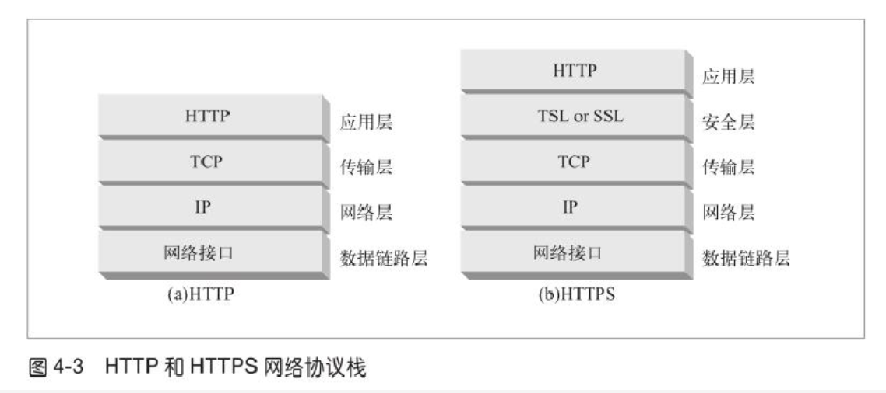
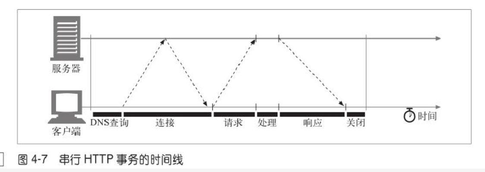
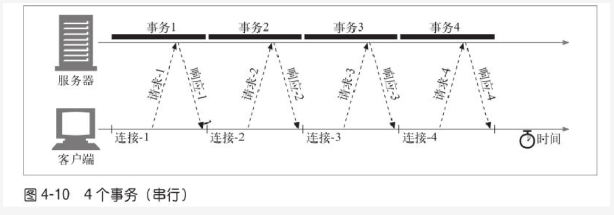
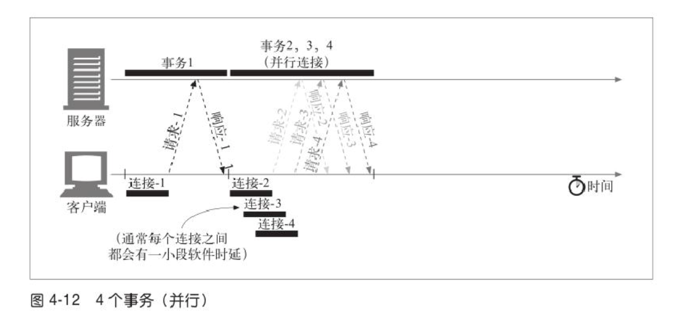
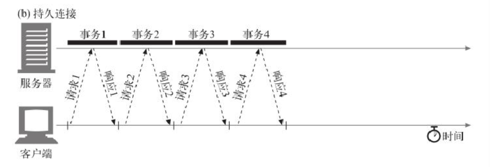
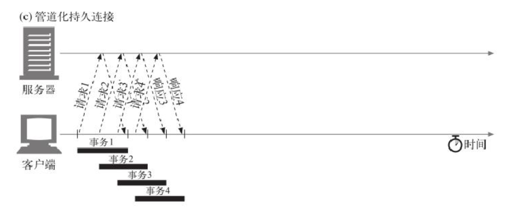

#### http connection

#### tcp detail

#### http和https差距

#### Connection
- 串行连接

- 并行连接：通过多条 TCP 连接发起并发的 HTTP 请求

- 持久连接：重用 TCP 连接，以消除连接及关闭时延

- 管道化连接：通过共享的 TCP 连接发起并发的 HTTP 请求

- 复用的连接：交替传送请求和响应报文（实验阶段）

#### http事物的时延
1. 客户端首先需要根据URI确定Web服务器的IP地址和端口号，即DNS解析。如果我们是第一次访问某个URL中的主机名，那么这次DNS解析可能花费数十秒。
2. 接下来，客户端向服务端发送一条TCP连接请求，并等待服务端的回复。每条新的TCP连接都会有最多一两秒钟的连接建立时延，但如果有数百个HTTP事务的话，这个值可能会快速叠加上去。
3. 连接建立起来之后，客户端开始通过该TCP通道发送HTTP请求，Web服务器从TCP通道中读取到请求报文，对该报文进行解析处理，这个过程需要时间。这个过程中对报文的解析处理可能会占据较多时间。
4. 最后，Web服务器回传HTTP响应，这也需要时间。

#### 性能聚集区域
###### TCP连接建立握手
1. 请求新的TCP连接时， 客户端要向服务器发送一个小的TCP分组(40~60byte)。 这个分组中设置了一个特殊的SYN(同步序列编号Synchronize Sequence Numbers)标记，说明这是一个连接请求
2. 如果服务器接受了连接，就会对一些连接参数进行计算，并向客户端会送一个TCP分组，这个分组中的SYN和ACK(确认字符Acknowledge character)标记都被置位，说明连接请求已被接受
3. 最后，客户端向服务器会送一条确认信息，通知它连接已成功建立。现代的TCP栈都允许客户端在这个确认分组中发送数据。

###### 延迟确认？  
###### TCP慢启动（传输分组？）
TCP连接会随着时间进行自我调谐，起初会限制连接的最大速度，如果数据成功传输，会随着时间的推移提高传输的速度。
###### Nagle算法与TCP_NODELAY？
###### TIME_WAIT累计与端口耗尽
