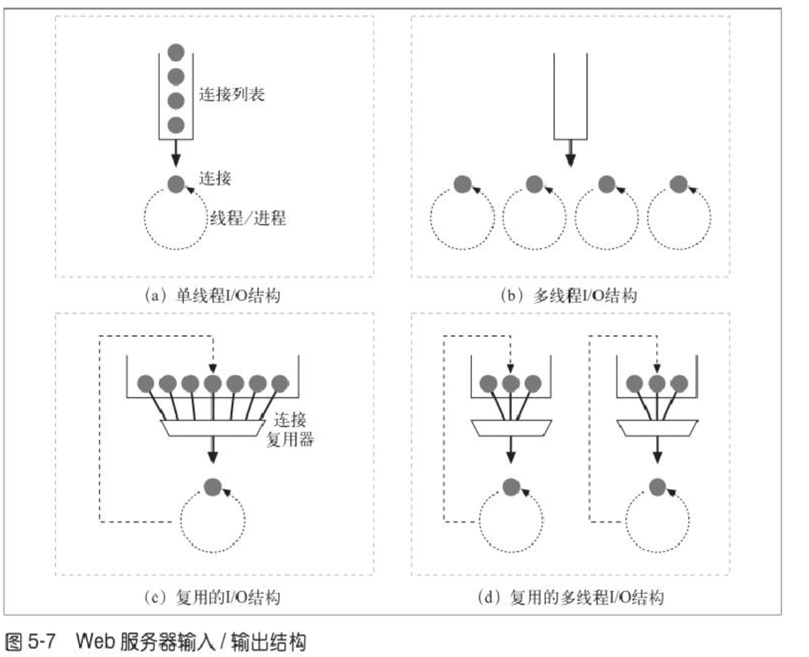

#### web 服务器
- apache
- tomcat
- nodejs
- nginx

#### 嵌入式Web服务器(embeded server)
- 打印机，家用设备

#### 服务器功能
- 丰富的资源支持
- 虚拟主机
- 访问控制
- 日志记录
- 配置
- 监视
- 性能测试

#### 服务器执行
1. 建立连接
2. 接收请求
3. 处理请求
4. 访问资源
5. 构建响应
6. 发送响应
7. 记录事务处理过程

#### 接收请求 - server IO

- 单线程服务器
  单线程的web服务器一次只处理一个请求， 直到其完成为止。一个事务处理结束之后，才去处理下一条连接。这种结构易于实现，但在处理过程中，所有其他连接都会被忽略。这样会造成严重的性能问题，只适用于低负荷的服务器。

- 多进程及多线程服务器
  可以根据需要创建，或者预先创建一些线程/进程。有些服务器会为每条连接分配一个线程/进程，但当服务器同时要处理成百，上千甚至数万计连接时，需要的进程或线程数量可能会消耗太多的内存或系统资源。因此，很多多线程web服务器都会对线程/进程的最大数量进行限制。

- 复用I/O服务器
  为了支持大量的连接，很多web服务器都采用了复用结构。在复用结构中，要同时监视所有连接上的活动。当连接的状态发生变化时(有数据可用，或出现错误时)，就对那条连接进行少量的处理；处理结束之后，将连接返回到开放连接列表中，等待下一次状态变化。只有在有事情可做时才会对连接进行处理；在空闲连接上等待的时候并不会绑定线程和进程。

- 复用多线程
  有些系统会将多线程和复用功能结合在一起，以利用计算机平台上的多个CPU。多个线程中的每一个都在观察打开的连接，并带回每条连接执行少量的任务。

#### memo

- 很多大容量web服务器要么会禁止主机名解析， 要么只允许特定内容进行解析