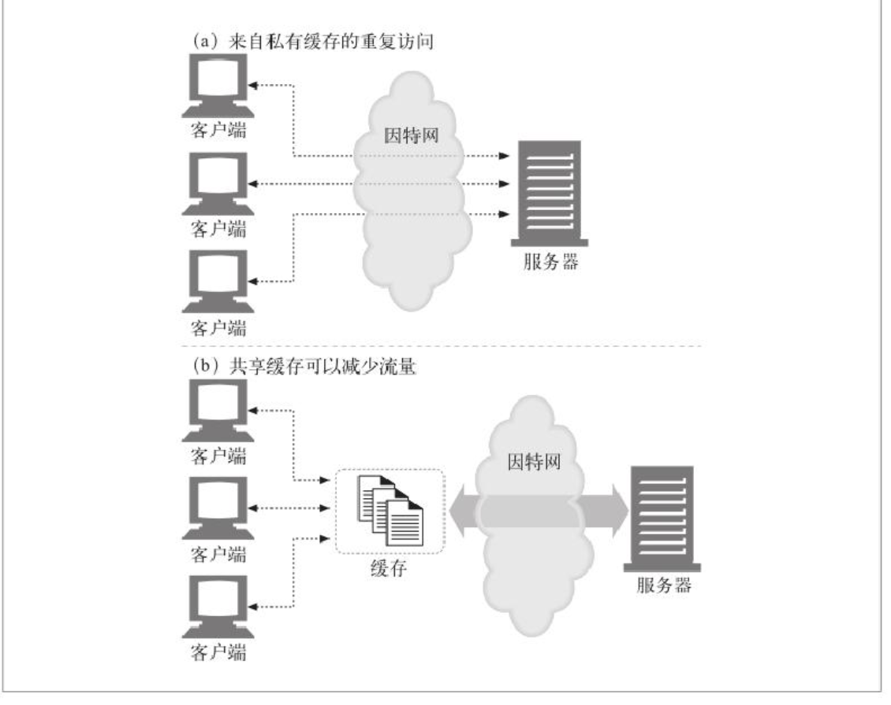

#### Cache优点

- 缓存减少了沉郁的数据传输，节省了你的网络费用
- 缓存缓解了网络瓶颈的问题。不需要更多的宽带就能够更快的加载页面
- 缓存降低了对原始服务器的要求。服务器可以更快的响应，避免过载的出现
- 缓存降低了距离时延，因为从较远的地方加载页面会更慢一些。


#### 再验证

If-Modifed-Since


#### 私有缓存

大多数浏览器都会将常用文档缓存在个人电脑的磁盘或内存中。


#### 公有代理缓存




#### 缓存的处理步骤

1. 接收 - 缓存从网络中读取抵达的请求报文
2. 解析 - 缓存对报文进行解析，提取出URL和各种首部
3. 查询- 缓存查看是否有本地副本可用，如果没有，就获取一份副本并将其保存在本地
4. 新鲜度检测 - 缓存查看副本是否足够新鲜，如果不是，就询问服务器是否有任何更新
5. 创建响应 - 缓存会用新的首部和已缓存的主体来构建一条响应报文
6. 发送 - 缓存通过网络将响应发回给客户端
7. 日志 - 缓存可选的创建一个日志文件条目来描述这个事务


#### 文档过期

```
// response
Expires: Fri, 05 Jul 2004, 04:00:00 GMT
or
Cache-Control: max-age=484200
```


#### 缓存再验证

```
// request
If-Modified-Since: Sat, 29 Jun 2005, 12:30:00 GMT
or
If-None-Match: "v3"

// response
Etag: "v3"
```


#### Etag 和 If-Modified-Since 怎么选

- 服务器返回Etag就必须使用If-NoneMatch
- 服务区返回Expires或者Cache-Control就使用If-Modifed-Since


#### Cache-Control

- no-cache

- no-store

- max-age

- must-revalidate

  