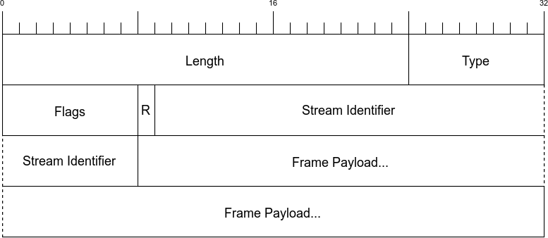

#### http/2 帧

| name   | length | description                 |
| ------ | ------ | --------------------------- |
| Length | 3byte  | 表示帧负载的长度(区直范围  2^14 ~ 2^24-1)。请注意，2^14字节是默认的最大帧大小，如果需要更大的帧，必须在SETTINGS帧中设置 (16,384 ~ 16,777,216) |
| Type | 1byte  | 当前帧类型 |
| Flags | 1byte  | 具体帧类型的标识 |
| R | 1bit   | 保留为，不要设置，否则可能带来严重后果 |
| StreamIdentifier | 31bit  | 每个流的唯一ID |
| Frame Payload | ~      | 真是的帧内容，长度是在Length字段中设置的 |

#### HTTP/2帧类型

| name          | id   | description                            |
| ------------- | ---- | -------------------------------------- |
| DATA          | 0x0  | 传输流的核心内容                       |
| HEADERS       | 0x1  | 包含HTTP首部，和可选的优先级参数       |
| PRIORITY      | 0x2  | 指示或者更改流的优先级和依赖           |
| RST_STREAM    | 0x3  | 允许一端停止流(通常由于错误导致的)     |
| SETTINGS      | 0x4  | 协商连接级参数                         |
| PUSH_PROMISE  | 0x5  | 提示客户端，服务器要推送些东西         |
| PING          | 0x6  | 测试连接可用性和往返时延(RTT)          |
| GOAWAY        | 0x7  | 告诉另一端，当前端已结束               |
| WINDOW_UPDATE | 0x8  | 协商一端将要接收多少字节(用于流量控制) |
| CONTINUATION  | 0x9  | 用以扩展HEADER数据块                   |

