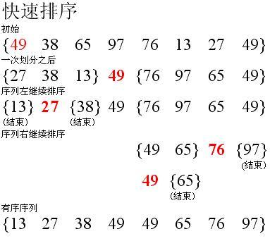

## Sort 排序
###### 算法复杂度

- 稳定：如果a原本在b前面，而a=b，排序之后a仍然在b的前面。
- 不稳定：如果a原本在b的前面，而a=b，排序之后 a 可能会出现在 b 的后面。
- 时间复杂度：对排序数据的总的操作次数。反映当n变化时，操作次数呈现什么规律。
- 空间复杂度：是指算法在计算机

```js
function Sort() {
  const list = [];

  this.push = (e) => list.push(e);
  this.print = () => list;
  // 希尔
  this.shell = () => {}
  // 堆
  this.heap = () => {}
}
```

###### bubble 冒泡排序

```js
// 冒泡
this.bubble = () => {
  for (let i = 0; i < arr.length - 1; i++) {
    for (let j = i + 1; j < arr.length - 0; j++) {
      if (arr[i] > arr[j]) {
        [arr[i], arr[j]] = [arr[j], arr[i]]
      }
    }
  }
  return arr
}
```

###### selection 选择排序

```js
// 选择
this.selection = () => {
  for (let i = 0; i < arr.length - 1; i++) {
    let min = i;
    for (let j = i + 1; j < arr.length; j++) {
      if (arr[min] > arr[j]) {
        min = j
      }
    }
    [arr[i], arr[min]] = [arr[min], arr[i]]
  }
  return arr
}
```

###### insertion 插入排序

```js
// 插入
this.insertion = () => {
  let current;
  for (let i = 1; i < arr.length; i++) {
    current = i;
    while (arr[current - 1] > arr[current]) {
      [arr[current - 1], arr[current]] = [arr[current], arr[current - 1]]
      current = current - 1;
    }
  }
  return arr;
}
```

###### shell 希尔排序

```js

```

###### merge 归并排序

```js
this.merge = () => {

  function sliceData(lst) {
    const length = lst.length;
    if (length < 2) {
      return lst;
    }
    let mid = Math.floor(length / 2);

    return mergeData(sliceData(lst.slice(0, mid)), sliceData(lst.slice(mid, length)))

  }

  function mergeData(left, right) {
    let result = [];
    
    while (left.length > 0 && right.length > 0) {
      result.push(left[0] > right[0] ? right.shift() : left.shift());
    }

    if(left.length){
      result = result.concat(left)
    }
    if(right.length){
      result = result.concat(right)
    }
    return result;
  }
  return sliceData(list)
}
```

###### quick 快速排序


```js
// 快速
this.quick = () => {

  function sliceData(arr){
    if(arr.length <2){
      return arr
    }

    let left = [];
    let right = [];

    for(let i=1;i<arr.length;i++){
      arr[i] < arr[0] ? left.push(arr[i]) : right.push(arr[i]);
    }
    return [...sliceData(left),arr[0],...sliceData(right)]
  }
  return sliceData(list)
}
```

###### heap 堆排序

```js

```

###### bucket 桶排序
```js
// 桶
this.bucket = (size) => {
  let bucket = [];
  let min = list[0]
  let max = list[0]
  let result = []

  // 生成桶
  for(let i=0;i<size;i++){
    bucket[i] = [];
  }
  // 获取最大值和最小值
  for(let i=1;i<list.length;i++){
    if(min>list[i]){
      min = list[i];
    }
    if(max<list[i]){
      max=list[i]
    }
  }
  
  // 装在桶
  for(let i=0;i<list.length;i++){
    bucket[Math.floor(list[i]*size/(max+1))].push(list[i])
  }

  // 遍历桶并集成到result
  for(let i=0;i<size;i++){
    bucket[i].sort((a,b) => a-b) // 排序
    for(let j=0;j<bucket[i].length;j++){
      result.push(bucket[i][j])
    }
  }
  return result;
}
```

###### count 计数排序

```js
// 计数
this.count = () => {
  const result = []
  const kv = []

  for (let i = 0; i < arr.length; i++) {
    const k = arr[i]
    if (!kv[k]) {
      kv[k] = 0;
    }
    kv[k]++
  }

  for(let i =0;i< kv.length; i++){
    
    if(kv[i]){
      while(kv[i]>0){
        kv[i]--
        result.push(i)
      }
    }
  }
  arr = result
  return arr;
}
```

###### radix 基数排序

```js
// 基数
this.radix = () => {
  let map = {}
  function resetMap() {
    for (let i = 0; i < 10; i++) {
      map[i] = [];
    }
  }
  resetMap()

  function updateList() {
    list.length = 0
    for (let i = 0; i < 10; i++) {
      for (let j = 0; j < map[i].length; j++) {
        list.push(map[i][j])
      }
    }
    resetMap()

  }
  let maxLength = 999;

  for (let i = 0; i < maxLength; i++) {
    for (let j = 0; j < list.length; j++) {
      // 第一次循环时后 判断max
      if (i === 0) {
        maxLength = Math.max(list[j], maxLength)
      }

      let str = list[j].toString()
      let current = str[str.length - 1 - i]

      map[current === undefined ? 0 : current].push(list[j])
    }

    if (i === 0) {
      maxLength = `${maxLength}`.length
    }

    updateList()
  }
}
```
