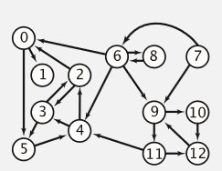
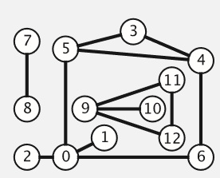

## Graph 图  （进行中）
#### 术语
- Graph = (Vertex, Edge)
- Vertex 一组顶点
- Edge 一组边
- 相邻顶点(一条边连接在一起的顶点)
- 度(一个顶点的度就是相邻顶点的数量)
- 简单路径(要求除去最后一个顶点，不包含重复的顶点)
- 环 - cycle(最后一个顶点重新回到顶点中)
- 有向图<br />
- 无向图<br />

###### 图的表示
- 邻接矩阵
- 邻接表
- 关联矩阵

```js
function Graph() {
  let vertices = []
  let adjList = {};

  // 类型判定
  const initializeType = () => {
    // 0 还没访问
    // 1 访问过但没搜索
    // 2 访问并且搜索过
    const type = {};
    vertices.forEach(e => {
      type[e] = '0'
    })
    return type;
  }

  // 添加顶点
  this.addVertex = (key) => {
    if (adjList[key]) {
      return ''
    }

    adjList[key] = []
    vertices.push(key)

  };

  // 添加边(连接)
  this.addEdge = (e1, e2) => adjList[e1].push(e2) && adjList[e2].push(e1);

  // bfs 广度优先
  this.bfs = (vertex) => {
    const type = initializeType();
    const queue = [vertex];
    type[vertex] = '1';

    while (queue.length !== 0) {

      const point = queue.shift();
      const targetPoints = adjList[point];
      for (let i = 0; i < targetPoints.length; i++) {
        const e = targetPoints[i];
        if (type[e] === '0') {
          queue.push(e);
          type[e] = '1';
        }
      }
      
      type[point] = '2';
    }
  }

  // dfs 深度优先
  this.dfs = (vertex) => {
    const type = initializeType();
    const stack = [vertex];
    type[vertex] = '1';

    while (stack.length !== 0) {
      const point = stack.shift();
      const targetPoints = adjList[point];
      for (let i = 0; i < targetPoints.length; i++) {
        const e = targetPoints[i];
        if (type[e] === '0') {
          stack.unshift(e);
          type[e] = '1';
        }
      }
      
      type[point] = '2';
      console.log(point)
    }
  }


  this.print = () => {
    let s = '';
    for (let k in adjList) {
      s += `${k} : `;
      adjList[k].forEach(e => {
        s += `${e}, `
      });
      s += `\n`;
    }
    return s;
  }
}

const a = new Graph();

['A', 'B', 'C', 'D', 'E', 'F', 'G', 'H', 'I'].forEach(e => a.addVertex(e));

a.addEdge('A', 'B')
a.addEdge('A', 'C')
a.addEdge('A', 'D')
a.addEdge('C', 'D')
a.addEdge('C', 'G')
a.addEdge('D', 'G')
a.addEdge('D', 'H')
a.addEdge('B', 'E')
a.addEdge('B', 'F')
a.addEdge('H', 'I')
```