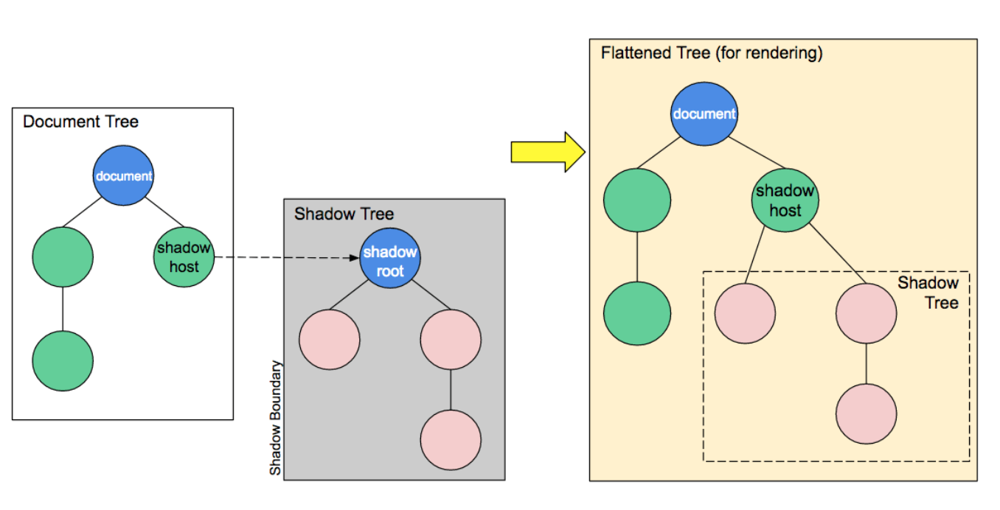

## custom element

##### autonomous custom elements

```js
// document.createElement('user-card')
customElements.define('user-card', UserCard)

class UserCard extends HTMLElement{
  constructor(){
    super()
    
    const image = document.createElement('img');
    image.src = 'https://semantic-ui.com/images/wireframe/image.png';
    image.width = '200'
    image.classList.add('image');

    this.append(image);
  }
}
```

###### customized build-in elements

```js
// document.createElement('div', {is: 'user-card'})
customElements.define('user-card', UserCard, {extends: 'div'})

class UserCard extends HTMLDivElement{
  constructor(){
    super()
    
    const image = document.createElement('img');
    image.src = 'https://semantic-ui.com/images/wireframe/image.png';
    image.width = '200'
    image.classList.add('image');

    this.append(image);
  }
}
```

#### Life cycle

```js
class UserCard extends HTMLDivElement{
  constructor(){
    super()
  }
  connectedCallback(){
    console.log('当组件首次被插入到文档DOM时')
  }
  disconnectedCallback(){
    console.log('当组件从文档DOM中删除时')
  }
  adoptedCallback(){
    console.log('当组件被移动到新的文档时')
  }
  attributeChangedCallback(){
    console.log('当组件增加，删除，修改自身属性时')
  }
}
```


## Shadow DOM



- Shadow host： 一个常规DOM节点， Shadow DOM 会被附加到这个节点上
- Shadow tree： Shadow DOM内部的DOM树
- Shadow boundary： Shadow DOM结束的地方，也是常规DOM开始的地方
- Shadow root： Shadow tree的根节点。

```js
class UserCard extends HTMLElement {
  constructor() {
    super();

    const shadow = this.attachShadow({mode:'closed'})
    
    const image = document.createElement('img');
    image.src = 'https://semantic-ui.com/images/wireframe/image.png';
    image.width = '200'
    image.classList.add('image');

    this.append(image);
    
    shadow.appendChild(this.content)
  }
};
```


## Template

```html
<template id="userCardTemplateProps">
  <style>
    :host{
      display:flex;
      width: 450px;
      height: 180px;
      background-color: #d4d4d4;
      border: 1px solid #d5d5d5
    }
    .image{
      flex: 0 0 auto
    }
    .name{
      color:chocolate
    }
  </style>

  
  <div class="container">
    <p class="name"></p>
    <p class="email"></p>
    <button class="button">follow</button>
  </div>
</template>
<div>
  <user-card-template-props name="daolang" email="jl-88@live.cn" />
</div>
<script>
class UserCardTemplateProps extends HTMLElement {
  constructor() {
    super();
    console.log(this)
    const tmp = document.getElementById('userCardTemplateProps');
    const content = tmp.content.cloneNode(true);
    content.querySelector('.container>.name').innerText = this.getAttribute('name')
    content.querySelector('.container>.email').innerText = this.getAttribute('email')
    this.appendChild(content)
  }
};
customElements.define('user-card-template-props', UserCardTemplateProps);
</script>
```

